# MemoryExam

## 💡 Краткое описание идеи

MemoryExam — это веб-приложение, которое позволяет пользователям создавать собственные коллекции изображений, структурировать их с помощью произвольных полей и изучать материал в различных режимах: карточки, тесты, экзамены. Проект разработан с акцентом на визуальное обучение и гибкость данных: одна база знаний может использоваться для разных форм проверки.

## 📦 Стек технологий

| Технология                      | Назначение                      |
| ------------------------------- | ------------------------------- |
| **React 18**                    | Библиотека для интерфейсов      |
| **TypeScript**                  | Типизация                       |
| **Vite**                        | Сборка и разработка             |
| **FSD** (Feature-Sliced Design) | Архитектурная методология       |
| **React Router v7**             | Маршрутизация                   |
| **React Hook Form**             | Управление формами              |
| **Zod**                         | Валидация схем                  |
| **Axios**                       | HTTP-клиент                     |
| **MSW**                         | Мокирование API                 |
| **IndexedDB**                   | Хранение изображений на клиенте |
| **CSS Modules**                 | Локальные стили                 |

## 🧠 Основной функционал

### Аутентификация и профиль

- Регистрация по почте с подтверждением кода
- Вход и выход из аккаунта
- Страница профиля с личной информацией и количеством наборов
- Изменение пароля

### Управление наборами

- Создание публичных и приватных наборов
- Редактирование метаданных (название, описание, видимость)
- Удаление наборов
- Поиск и фильтрация по видимости
- Генерация публичной ссылки для доступа

### Наполнение контентом

- Добавление объектов с изображениями
- Настройка произвольных полей (например, «Автор», «Год», «Стиль»)
- Редактирование и удаление объектов
- Массовый импорт из CSV/Excel + изображения
- Ручной массовый импорт (несколько изображений + поля)

### Режимы обучения

Все режимы работают поверх одной базы объектов и полей.

- **Карточки** – последовательный просмотр с оценкой «Помню/Забыл» и сохранением прогресса.
- **Тест** – выбор поля для тестирования, 4 варианта ответа, результаты с разбором ошибок.
- **Экзамен** – настройка количества вопросов и полей, случайная генерация, результаты.

### Публичный доступ

- Публичные наборы доступны по ссылке без авторизации (или с требованием авторизации – опционально)
- Владелец управляет доступными режимами (карточки, тест, экзамен) и видимостью ответов.

## 📸 Скриншоты

### • Лендинг

Главная страница с описанием возможностей.

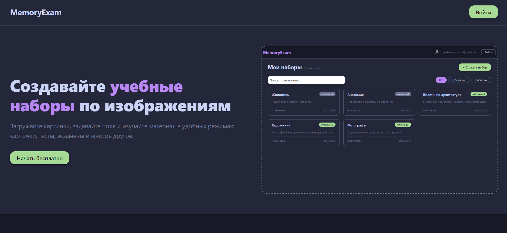

### • Профиль пользователя

Личная информация, количество наборов, кнопки выхода и изменения пароля.

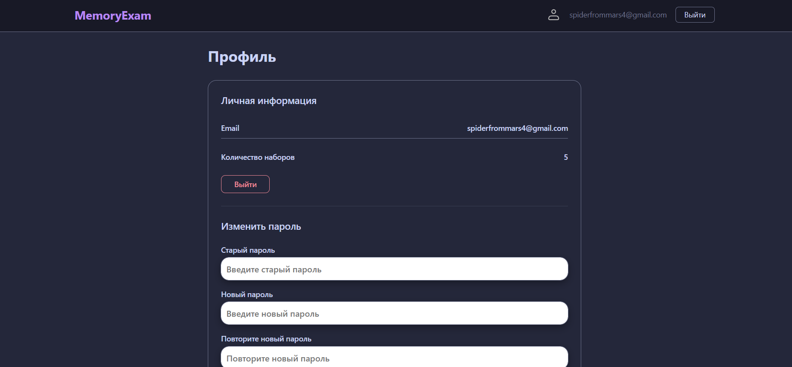

### • Список наборов

Все наборы пользователя с поиском, фильтром и счётчиком.

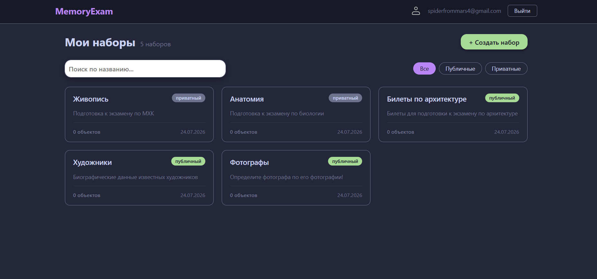

### • Создание набора

Модальное окно с названием, описанием и выбором видимости.

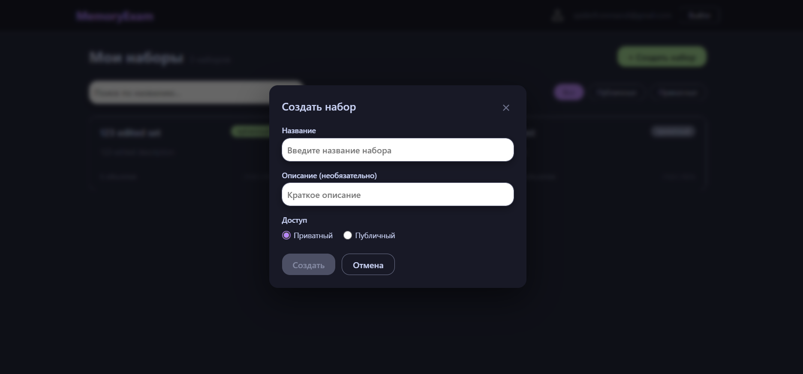

### • Страница набора (владелец)

Информация о наборе, управление полями, список объектов и кнопки действий.

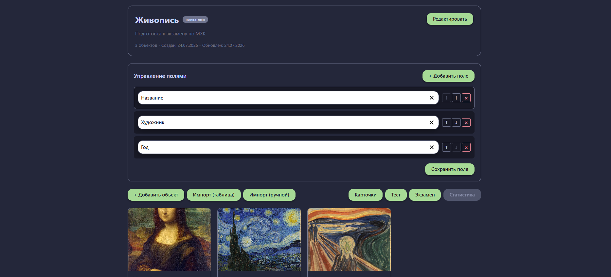

### • Редактирование набора

Изменение метаданных, настройка публичного доступа и режимов.

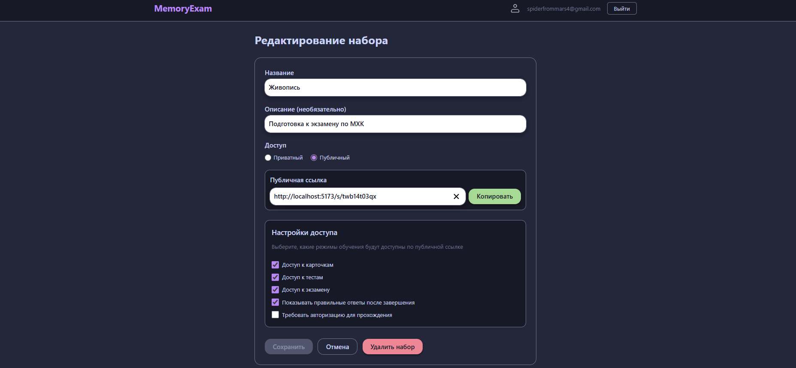

### • Импорт из таблицы (CSV/Excel)

Загрузка файла, сопоставление полей, предпросмотр и массовое создание объектов.

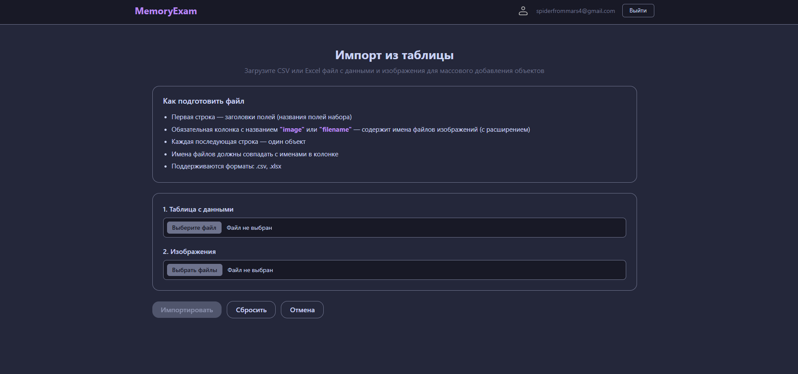

### • Ручной массовый импорт

Загрузка нескольких изображений с заполнением полей для каждого.

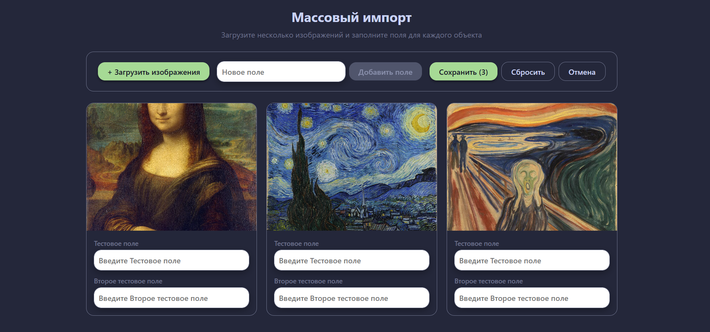

### • Публичная страница набора

Просмотр набора по ссылке (гостевой доступ) с доступными режимами.

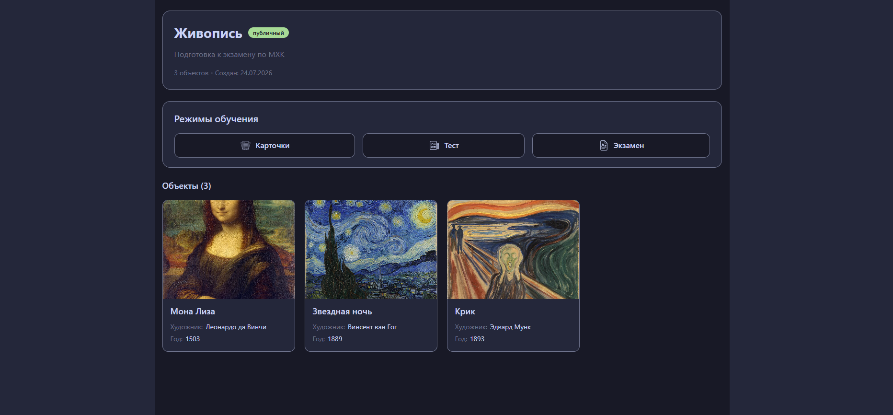

### • Режим «Карточки»

Последовательный просмотр с оценкой запоминания.

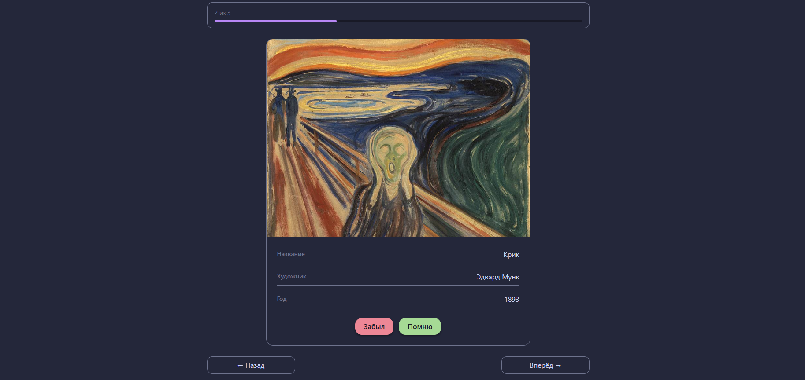

### • Режим «Тест»

Выбор поля и прохождение теста с вариантами ответов.

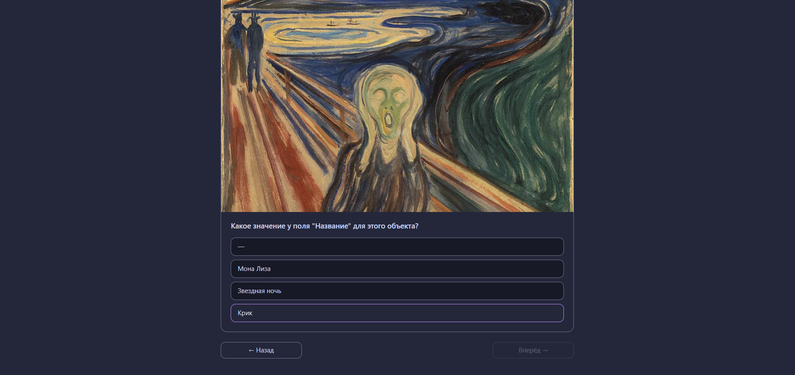

### • Режим «Экзамен»

Настройка параметров, прохождение и результаты.

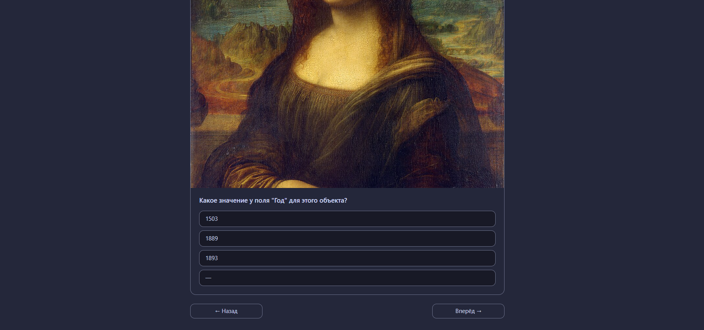

### • Результаты экзамена

Процент правильных, список ошибок с правильными ответами.

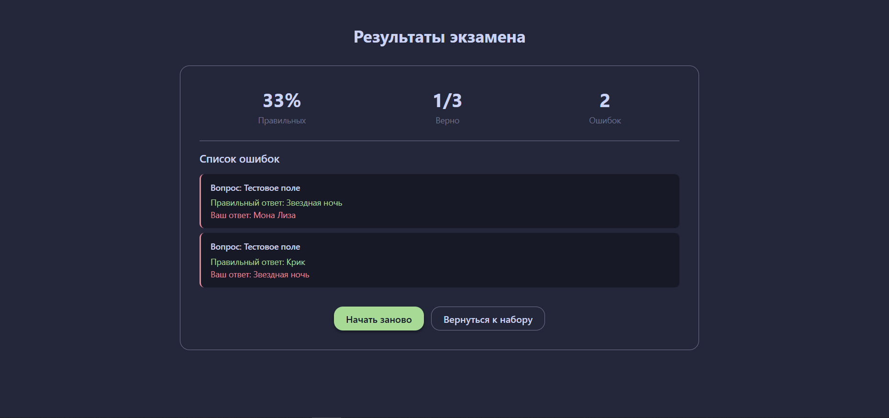

## 🛠️ Установка и запуск

### Требования

- Node.js 18+
- npm или yarn

### Клонирование репозитория

```bash
git clone https://github.com/your-username/memory-exam.git
cd memory-exam
```

### Установка зависимостей

```bash
npm install
```

### Запуск в режиме разработки

```bash
npm run dev
```

Приложение будет доступно по адресу: [http://localhost:5173/](http://localhost:5173)

### Сборка для продакшена

```bash
npm run build
```

### Предпросмотр собранного приложения

```bash
npm run preview
```

### Дополнительные скрипты

- `npm run lint` – проверка кода ESLint
- `npm run format` – форматирование кода (Prettier)

## 🧪 Особенности демо-версии

- Все данные хранятся в памяти MSW (при перезагрузке сбрасываются, но настройки сессии сохраняются в localStorage).
- Изображения сохраняются в IndexedDB, поэтому они сохраняются между перезагрузками.
- Деплой на GitHub Pages осуществлен, но не адаптирован под использование MSW, планируется использовать fallback-режим без Service Worker для исправления этой проблемы.
